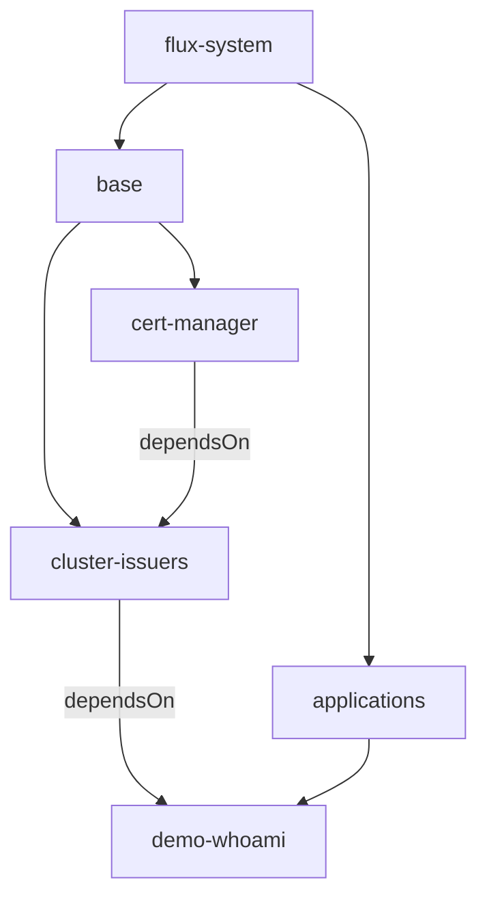

# FluxCD

[FluxCD](https://fluxcd.io/) déploie tout le contenu du cluster depuis la branche
`main` de ce repo : il réconcilie `manifest/flux-system/`, qui référence à son
tour les Kustomizations de `base/` et `applications/`.

## Bootstrap (one-shot)

Deux secrets sont nécessaires : une clé SSH pour lire ce repo GitHub, et la clé
age pour déchiffrer les secrets SOPS.

```bash
# 1. Deploy key GitHub (lecture seule) : Settings > Deploy keys > Add deploy key
ssh-keygen -t ed25519 -N "" -C flux-poc-ai4ops -f ./flux-deploy-key
cat ./flux-deploy-key.pub

# 2. Installation de Flux (secrets flux-system + sops-age, contrôleurs, sync)
make flux-bootstrap FLUX_KEY=./flux-deploy-key AGE_KEY=./age.agekey
```

Équivalent manuel :

```bash
flux create secret git flux-system --url=ssh://git@github.com/FabianCh/poc-ai4ops \
  --private-key-file=./flux-deploy-key
cat age.agekey | kubectl create secret generic sops-age \
  --namespace=flux-system --from-file=age.agekey=/dev/stdin
kubectl apply --server-side -f manifest/flux-system/gotk-components.yaml
kubectl apply --server-side -k manifest/flux-system
```

Mise à jour de Flux : mettre à jour la CLI `flux`, puis `bin/fluxcd/upgrade_fluxcd.sh`.

## Variables du cluster

La ConfigMap `flux-system/cluster-vars` est créée par le bootstrap de la VM
(Terraform), hors Git, car elle dépend de l'IP publique :

| Variable | Exemple |
| --- | --- |
| `EXTERNAL_IP` | `34.1.2.3` |
| `INGRESS_BASE_DOMAIN` | `34.1.2.3.sslip.io` |

Les Kustomizations qui en ont besoin la déclarent via
`postBuild.substituteFrom`, et les manifests utilisent `${INGRESS_BASE_DOMAIN}`.

## Organisation des déploiements


