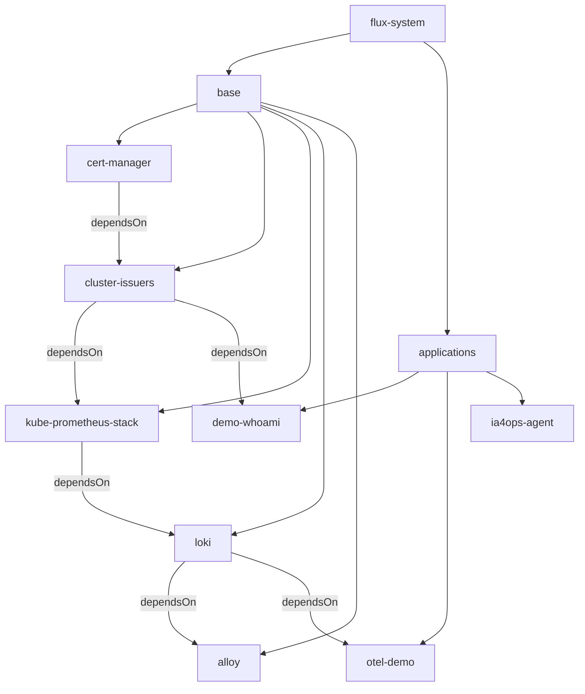

# FluxCD

[FluxCD](https://fluxcd.io/) déploie tout le contenu du cluster depuis la branche
`main` de ce repo : il réconcilie `manifest/flux-system/`, qui référence à son
tour les Kustomizations de `base/` et `applications/`.

## Installation (automatique)

Aucune action manuelle : au premier démarrage, le startup script de la VM
([`startup.sh.tftpl`](../../infra/gcp-k3s/templates/startup.sh.tftpl)) :

1. applique `install.yaml` de la release Flux (`flux_version`, défaut `v2.9.5`) ;
2. crée le `GitRepository` + la `Kustomization` `flux-system` (équivalent de
   `gotk-sync.yaml`), pointant en HTTPS sur ce repo public, branche `main`.

Flux se gère ensuite lui-même depuis ce dossier (`gotk-components.yaml`,
`gotk-sync.yaml`). Pour le mettre à jour : mettre à jour la CLI `flux`, puis
`bin/fluxcd/upgrade_fluxcd.sh` (et la variable Terraform `flux_version`).

## Variables du cluster

La ConfigMap `flux-system/cluster-vars` est créée par le bootstrap de la VM
(Terraform), hors Git, car elle dépend de l'IP publique :

| Variable | Exemple |
| --- | --- |
| `EXTERNAL_IP` | `34.1.2.3` |
| `INGRESS_BASE_DOMAIN` | `34.1.2.3.sslip.io` |

Les Kustomizations qui en ont besoin la déclarent via
`postBuild.substituteFrom`, et les manifests utilisent `${INGRESS_BASE_DOMAIN}`.

## Organisation des déploiements

